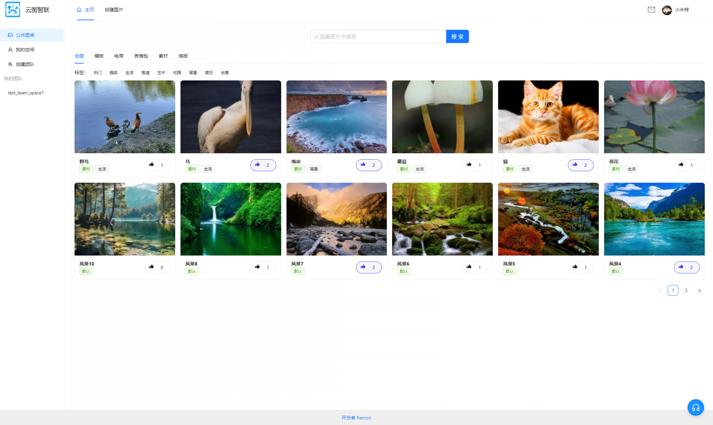
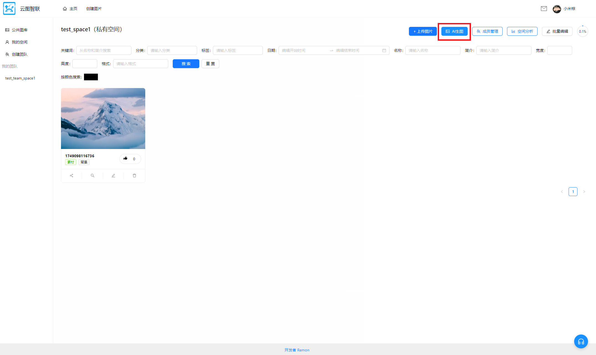
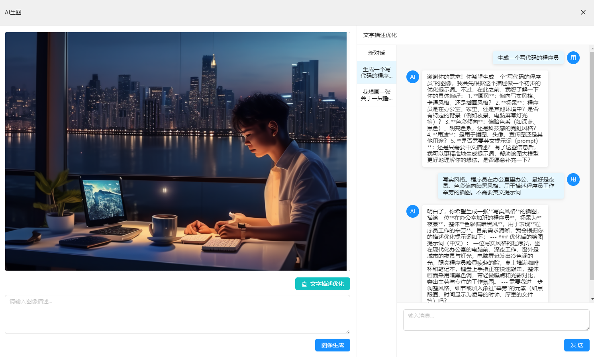
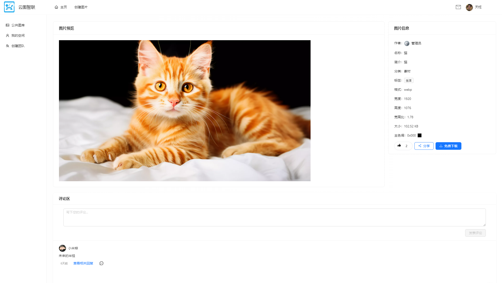
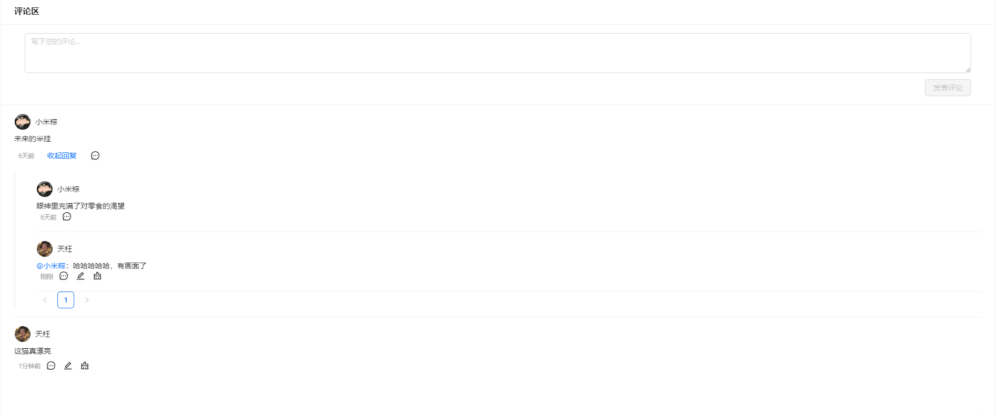
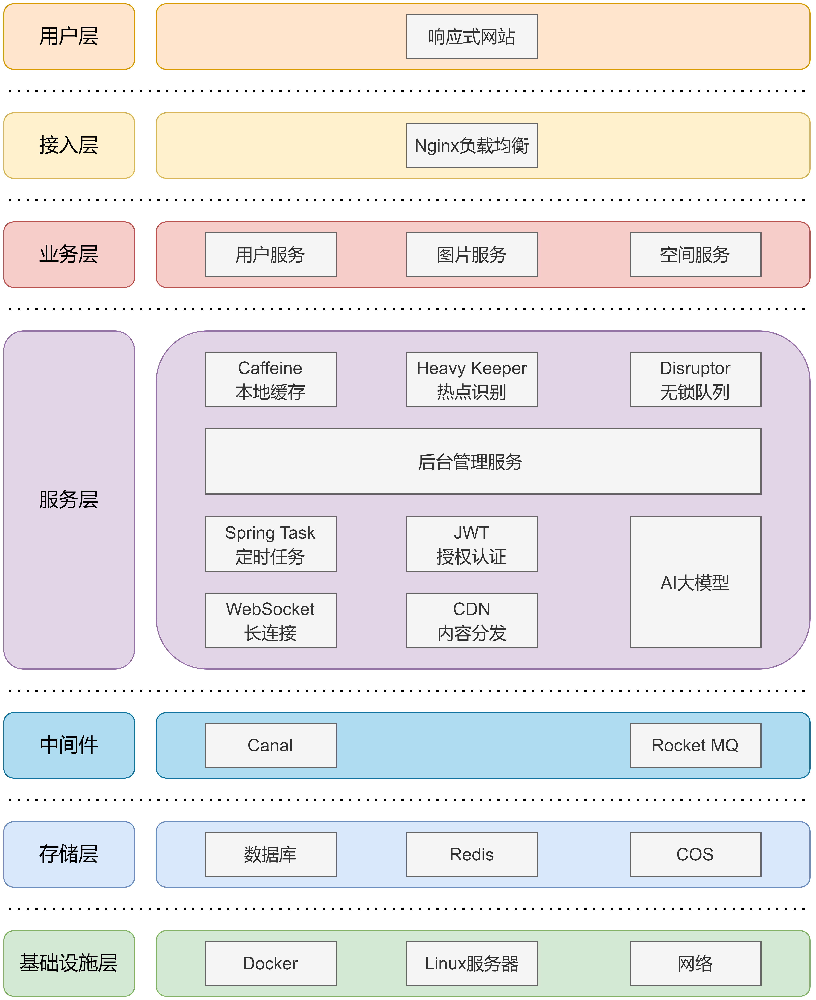

# 云图智联后端介绍
基于Spring Cloud + Al + Redis + MQ + WebSocket的企业级智能协同云图库平台。
 
项目主要可以分为公共图库、私有图库和团队共享图库三块。用户可以在公开平台上传、检索、下载、点赞和评论图片，可以通过AI客服了解平台各个模块的功能以及使用建议；用户在私有空间中可以上传、多维检索和批量管理图片，可以通过AI编辑图片和文本生图，也可以和AI绘画助手进行需求沟通，获取更清晰、准确的文生图提示词以提升图片生成质量；企业可以开通团队空间并邀请成员实时协同编辑图片；管理员可以上传、审核以及分析图片。
## 功能展示
### 网站首页

### AI客服

### 私有空间

### 文本生成图像
展开“文本描述优化”

关闭“文本描述优化”

### 图片详情

### 图片评论区

### 用户消息页

## 项目架构图

